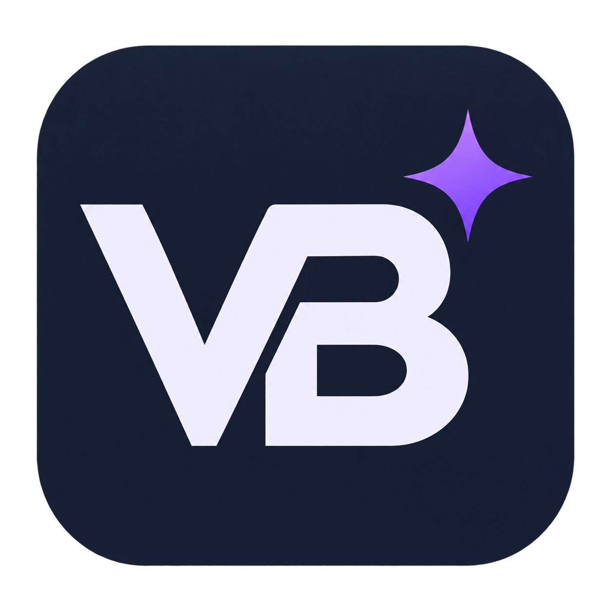

<p align="center"></p>

# VBAi

**Your AI agent for VBA.**

VBAi is a Windows x64 COM add-in that brings an AI assistant, Monaco editing and
Git workflows into applications that host the Visual Basic Editor. Work directly
with the open VBA project: understand code, review changes, design UserForms and
investigate native execution behavior.

[Website](https://blackcancer.github.io/VBAi/) · [Getting started](docs/getting-started.md) · [Documentation](docs/README.md) ·
[Compatibility](docs/compatibility.md) · [Contributing](CONTRIBUTING.md)

> **1.0.0 distribution:** the Windows x64 installer and uninstaller are unsigned.
> Windows may display an unknown-publisher warning. Native qualification is recorded
> for specific operations, host versions and candidate binaries. The final installer
> passed installation, repair, removal and reinstallation checks; see the exact
> [validation scope](docs/test-coverage.md#installer-lifecycle).

## Features

| Feature | Workflow |
| --- | --- |
| AI assistant | Discussion, Plan and Agent modes; explicit context, approvals, model/reasoning selection and persistent history |
| Modern editor | Monaco, VBA/COM completion, signatures, navigation, formatting, synchronization and compilation diagnostics |
| Change review | Diffs, revision checks, drafts, supported undo and recovery |
| Native VBE tools | Modules/classes, references, project properties, UserForms, windows and guarded execution/debugging |
| Git and GitHub | Exported-source versioning, branches, merges, checkpoints and reviewed import workflows |
| VBA test explorer | Annotated discovery, guarded serial runs, reports and procedure-entry coverage on supported document copies |

The shared VBE layer is the foundation. Application adapters provide canonical
document identity, persistence and host-specific execution. Read the
[compatibility matrix](docs/compatibility.md) for accepted scopes and limitations.

## Getting started

1. Complete [installation](docs/installation.md) and verify the loaded add-in.
2. Open a disposable copy of your VBA project and the host's VBE.
3. Configure a provider in VBAi settings; select a model and reasoning in the chat.
4. Start in **Discussion** and review the selected project/context.
5. Use **Agent** for an intended change, review the diff, compile and test it.
6. Save in the host application; commit or publish exported sources separately.

Example: *"Explain this procedure's error handling. Propose a minimal correction
and preserve its public interface."*

Codex is the default provider. API, CLI-backed and local integrations have their
own authentication, model capabilities and service costs. See
[providers](docs/providers.md) and [privacy](docs/privacy.md) before sharing
professional code. Compilation and AI output do not guarantee runtime correctness.

## Development

The solution targets .NET Framework 4.8, C# 7.3 and x64, with a native C++ renderer.
Build from a Windows development shell using an isolated output:

```powershell
dotnet build VBAi.sln -c Debug -p:BuildOutputRoot="$PWD/artifacts/build"
dotnet test tests/VBAi.Tests/VBAi.Tests.csproj -c Debug --no-build -p:BuildOutputRoot="$PWD/artifacts/build"
```

[Architecture](docs/architecture.md) · [Development guide](docs/development.md) ·
[Testing](tests/README.md) · [Recorded validation](docs/test-coverage.md) ·
[Changelog](CHANGELOG.md) · [Roadmap](docs/roadmap.md)

An isolated build does not replace a registered DLL. Use disposable projects
and explicitly selected hosts for native tests; preserve production macros and
host trust settings.

## Community and licensing

Use the issue templates for reproducible bugs, feature requests and host reports.
Read [contributing](CONTRIBUTING.md), [support](SUPPORT.md),
[security reporting](SECURITY.md) and [the code of conduct](CODE_OF_CONDUCT.md).

Original VBAi code is licensed under [MPL-2.0](LICENSE). VBA templates and support
runtimes intended for user projects use [MIT](LICENSES/MIT.txt). Third-party
components retain their original licenses. See [licensing scope](LICENSING.md)
and [third-party notices](THIRD_PARTY_NOTICES.md).
VBAi is an independent project; Microsoft, OpenAI, GitHub and host application
vendors do not publish or endorse it.

## Code signing policy

Version 1.0.0 is distributed without Authenticode signatures. Signed builds and
their uninstallers require trusted, timestamped signatures before acceptance by
the release tooling. The automatic updater retains its signature requirement.
SignPath Foundation onboarding is being evaluated; no certificate or sponsorship
has been granted. See [code signing](docs/code-signing.md).
